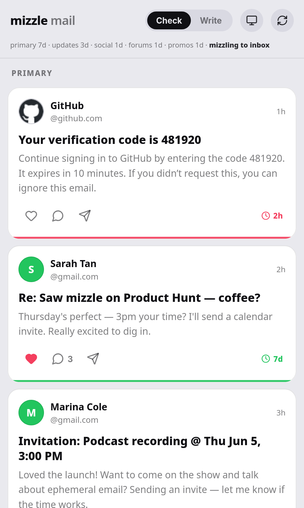
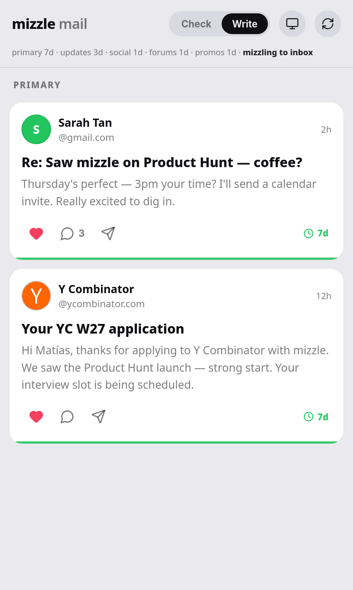
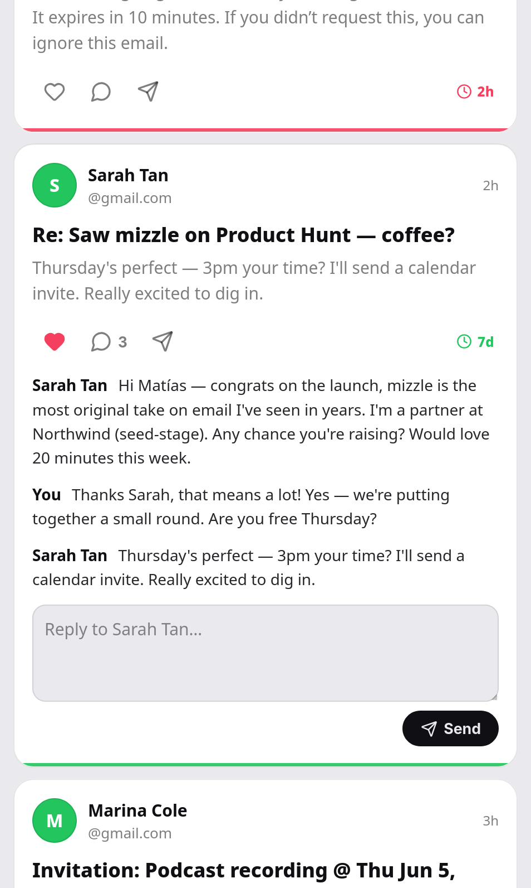
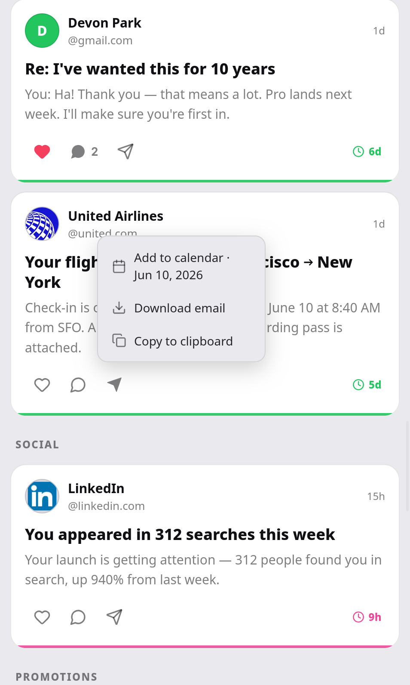
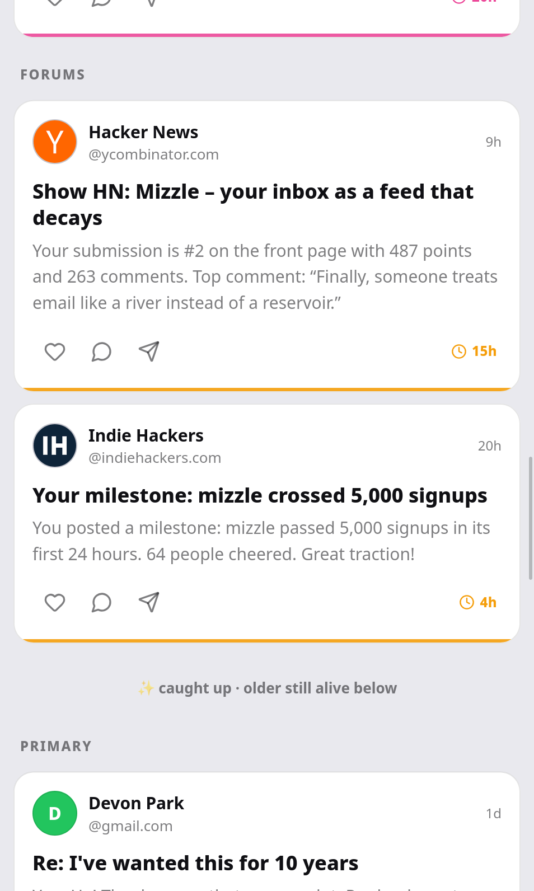
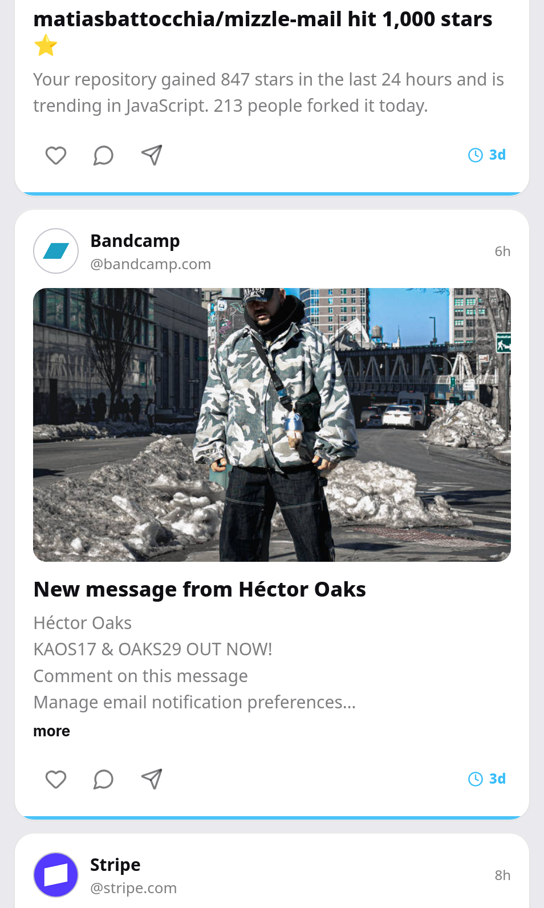

# Mizzle Mail

**Your Gmail inbox as an ephemeral feed.** You scroll it like Instagram, act on what matters, and let the rest *mizzle* — drizzle in, then quietly vanish. Nothing accrues. The inbox is a **pipe, not a tank**.

> *mizzle* (v.) — to drizzle; also, *to vanish or slip away*.

See [MANIFESTO.md](./MANIFESTO.md) for the why. This repo is the working prototype.

---

<table align="center">
  <tr>
    <td></td>
    <td></td>
    <td></td>
  </tr>
  <tr>
    <td></td>
    <td></td>
    <td></td>
  </tr>
</table>

## What it does

- Scroll your inbox like a feed.
- Your email decays; nothing lasts past **7 days**.
- Should not decay? It will. Export it to Google Calendar or download it out.
- Two modes: **Check** to graze · **Write** when you're in the mood.
- Like ❤️️ = filter for "write later".
- No local state, everything stays synced to Gmail.

<p align="center">
  <a href="https://www.producthunt.com/products/mizzle-mail?utm_source=badge-follow&utm_medium=badge&utm_source=badge-mizzle&#0045;mail" target="_blank"></a>
</p>

## How it works

A tiny local relay talks to Gmail over **IMAP** (`imapflow`) and **SMTP** (`nodemailer`) using a **Gmail App Password** — no OAuth, no app-verification, no server farm holding your mail. The frontend is dependency-free vanilla JS. Decay is computed on the fly; the inbox itself is the only store.

```
server/
  index.js       Express relay + API
  transport.js   IMAP/SMTP
  decay.js       category-based TTLs
public/          vanilla-JS client
test/            node --test unit tests
```

## Setup

Requires Node 18+ and a Gmail account with **2-Step Verification** on, so you can [mint an App Password](https://myaccount.google.com/apppasswords).

```sh
git clone https://github.com/matiasbattocchia/mizzle-mail && cd mizzle-mail
npm install

cp .env.example .env

npm start
open http://localhost:4173
```

> **Security:** your App Password lives only in `.env`, which is git-ignored — never commit it. Revoke it anytime from your Google account.

## Deploy (self-host)

Run your **own** instance — single-tenant, your Gmail, your server. mizzle never holds anyone else's mail.

[](https://render.com/deploy?repo=https://github.com/matiasbattocchia/mizzle-mail) &nbsp; [](https://replit.com/github/matiasbattocchia/mizzle-mail)

Set `EMAIL`, `APP_PASSWORD`, and `AUTH_PASSWORD` as the host's secrets/env vars (never in the repo).

> ### ⚠️ Set `AUTH_PASSWORD` or the instance is open
> The web UI has an optional login gate (HTTP basic auth, username = your `EMAIL`). It's **on only when `AUTH_PASSWORD` is set** — so set it on any deployed/shared URL, or anyone with the link can read and act on your inbox. Use a **distinct** password, **not** your `APP_PASSWORD` (that's your Gmail key). Leaving it unset is fine only for local `npm start`.

Notes: free tiers sleep on idle (first load is slow while it wakes), and on hosts with an ephemeral disk the onboarding cutoff (`data/state.json`) re-seeds on each deploy — adjust `SEED_DAYS` if needed.

## Configuration (`.env`)

| Var | Default | Meaning |
|---|---|---|
| `EMAIL` | — | your Gmail address |
| `APP_PASSWORD` | — | a Gmail App Password (not your login password) |
| `AUTH_PASSWORD` | — | login gate for the UI (username = `EMAIL`); unset = open. Required for any deployed URL; use a **distinct** password |
| `MIZZLE_TO` | `inbox` | what happens when a message decays out: `inbox` · `archive` (→ All Mail) · `delete` (→ Trash, recoverable ~30d) · `mixed` (touched → archive, untouched → delete) |